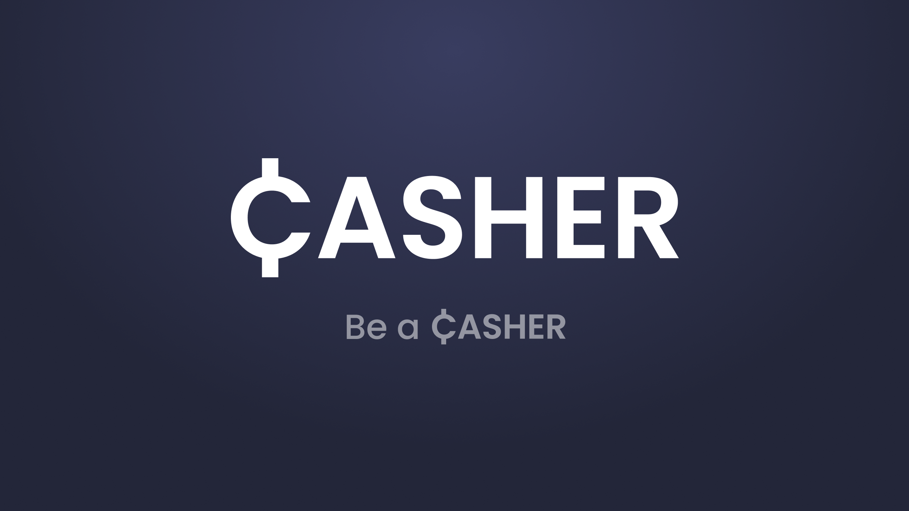

# Casher



Casher is a Software as a Service solution that provides a usercentric, bulletproof, typesafe, valid, battletested, blazingly fast, serverside-renderd, Progressive-Web-App (PWA) which, with the help of a centrelised AI-Service, automatically analyzes realtime Finance Big Data and provides the user with actionable Analytics.

## Getting Started

First, run the development server:

```bash
yarn install
yarn dev
```

Open [http://localhost:3000](http://localhost:3000) with your browser to see the result.

## Prisma Database

[Prisma Client JS](https://www.prisma.io/docs/reference/tools-and-interfaces/prisma-client/api) is a type-safe database client auto-generated based on the data model.

Before you get started, generate Prisma Client JS by running

> **Note**: Every time you update [schema.prisma](prisma/schema.prisma) re-generate Prisma Client JS

```bash
npx prisma generate
# or
yarn prisma:generate
```

If you want to view or edit data in database, thanks to the help of Prima Studio, it is as easy as running:

```bash
npx prisma studio
# or
yarn primsa:studio
```

## Auth0 Configuration

### Configure credentials

The project needs to be configured with your Auth0 Domain, Client ID and Client Secret for the authentication flow to work.

To do this, first copy `.env.local.example` into a new file in the same folder called `.env.local`, and replace the values with your own Auth0 application credentials (see more info about [loading environmental variables in Next.js](https://nextjs.org/docs/basic-features/environment-variables)):

```sh
# A long secret value used to encrypt the session cookie
AUTH0_SECRET='LONG_RANDOM_VALUE'
# The base url of your application
AUTH0_BASE_URL='http://localhost:3000'
# The url of your Auth0 tenant domain
AUTH0_ISSUER_BASE_URL='https://YOUR_AUTH0_DOMAIN.auth0.com'
# Your Auth0 application's Client ID
AUTH0_CLIENT_ID='YOUR_AUTH0_CLIENT_ID'
# Your Auth0 application's Client Secret
AUTH0_CLIENT_SECRET='YOUR_AUTH0_CLIENT_SECRET'
# Your Auth0 API's Identifier
# OMIT if you do not want to use the API part of the sample
AUTH0_AUDIENCE='YOUR_AUTH0_API_IDENTIFIER'
# The permissions your app is asking for
# OMIT if you do not want to use the API part of the sample
AUTH0_SCOPE='openid profile email read:shows'
```

**Note**: Make sure you replace `AUTH0_SECRET` with your own secret (you can generate a suitable string using `openssl rand -hex 32` on the command line).
